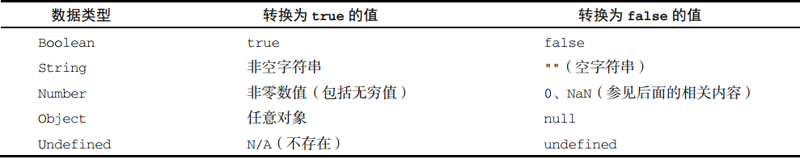

# 数据类型

### 布尔 boolean

true / false

<figure><figcaption><p>不同类型与布尔之间的转换</p></figcaption></figure>

### 数值 number

所有数字都是浮点数

有一个特殊的数值叫 <mark style="color:red;">NaN</mark>，意思是“不是数值”（ Not a Number），**用于表示本来要返回数值的操作 失败了（而不是抛出错误）。**

#### **数值转换规则**

* 布尔值， true 转换为 1， false 转换为 0。
* 数值，直接返回。&#x20;
* null，返回 0。&#x20;
* undefined，返回 NaN。&#x20;
* 字符串，应用以下规则。&#x20;
  * 如果字符串包含数值字符，包括数值字符前面带加、减号的情况，则转换为一个十进制数值。 因此， Number("1")返回 1， Number("123")返回 123， Number("011")返回 11（忽略前面 的零）。&#x20;
  * 如果字符串包含有效的浮点值格式如"1.1"，则会转换为相应的浮点值（同样，忽略前面的零）。&#x20;
  * 如果字符串包含有效的十六进制格式如"0xf"，则会转换为与该十六进制值对应的十进制整 数值。&#x20;
  * 如果是空字符串（不包含字符），则返回 0。&#x20;
  * 如果字符串包含除上述情况之外的其他字符，则返回 NaN。&#x20;
* 对象，调用 valueOf()方法，并按照上述规则转换返回的值。如果转换结果是 NaN，则调用 toString()方法，再按照转换字符串的规则转换。

### 字符串 string

可以使用双引号（ `"`）或单引号（`'`）表示字符串

字符串是不可变的，意思是一旦创建，它们的值就不能变了。要修改某个变量中的字符串值，必须先销毁原始的字符串，然后将包含新值的另一个字符串保存到该变量。

如果你不确定一个值是不是 null 或 undefined，可以使用 String()转型函数，它始终会返回表 示相应类型值的字符串。 String()函数遵循如下规则:

* 如果值有 toString()方法，则调用该方法（不传参数）并返回结果。
* 如果值是 null，返回"null"。&#x20;
* 如果值是 undefined，返回"undefined"。

```javascript
let name = "Tom"
console.log(`name:${name}`) // 字符串插值
let temp =
`床前明月光，
    疑是地上霜。
举头望明月，
    低头思故乡。
`
console.log(temp) // 字面模板 保留原格式
```

### 符号 symbol

ECMAScript 6 新增，符号是原始值，且符号实例是唯一、不可变的。&#x20;

符号的用途是确保对象属性使用唯一标识符，不会发生属性冲突的危险，进而用作非字符串形式的对象属性。

使用全局符号注册表：Symbol.for()

```javascript
let name1 = Symbol.for("name")
let name2 = Symbol("name")
let name3 = Symbol.for("name")
console.log(name1 === name2) // false
console.log(name1 === name3) // true
```

Symbol.for()对每个字符串键都执行幂等操作。第一次使用某个字符串调用时，它会检查全局运行时注册表，发现不存在对应的符号，于是就会生成一个新符号实例并添加到注册表中。后续使用相同字符串的调用同样会检查注册表，发现存在与该字符串对应的符号，然后就会返回该符号实例。

### 未定义 undefined

声明了变量但没有初始化时，就相当于给变量赋予了 undefined 值

### 空值 null

空值, 表示一个空对象指针, if表达式判断中为假值(false)

### 对象 object

一种无序名值对的集合

每个 Object 实例都有如下属性和方法：

* constructor：用于创建当前对象的函数。在前面的例子中，这个属性的值就是 Object() 函数。&#x20;
* hasOwnProperty(propertyName)：用于判断当前对象实例上是否存在给定的属性（不是原型上）。要检查的属性名必须是字符串（如 o.hasOwnProperty("name")）或符号。
* isPrototypeOf(object)：用于判断当前对象是否为另一个对象的原型。
* propertyIsEnumerable(propertyName)：用于判断给定的属性是否可以使用 for-in 语句枚举。与 hasOwnProperty()一样，属性名必须是字符串。&#x20;
* toLocaleString()：返回对象的字符串表示，该字符串反映对象所在的本地化执行环境。&#x20;
* toString()：返回对象的字符串表示。&#x20;
* valueOf()：返回对象对应的字符串、数值或布尔值表示。通常与 toString()的返回值相同。

### typeof 操作符

```javascript
let age = 10
console.log(typeof age) // number
let flag = true
console.log(typeof flag) // boolean
let name = "Tom"
console.log(typeof name) // string
let obj = {}
console.log(typeof obj) // object
let dog = null
console.log(typeof dog) // object
let car
console.log(typeof car) // undefined
let syl = Symbol("key")
console.log(typeof syl) // symbol

let a = function test() {
    console.log("hello test")
}
console.log(typeof a) // function
```
